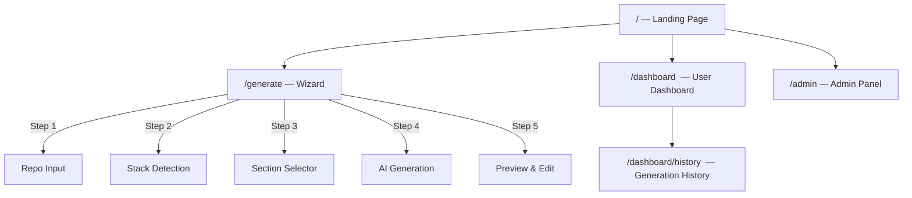

# DevDocs V2 — UI/UX Design Handoff

> **Purpose:** Everything a designer needs to know about the app's pages, user flows, states, and backend integration points — so the redesigned UI can be plugged directly into the existing backend.

---

## 1. Site Map



---

## 2. User Tiers & Auth States

The UI must handle **3 tiers** and **2 auth states**:

| Tier | Auth State | Daily Generations | Saved READMEs | Sections Available |
|------|-----------|-------------------|---------------|-------------------|
| **Anonymous** | Not logged in | 5 | 0 | 6 basic |
| **Free** | GitHub OAuth | 50 | 10 | 12 (basic + extra) |
| **Premium** | GitHub OAuth + paid | ∞ | ∞ | All |

### Auth Components the Designer Must Account For

| Component | Where It Appears | Behavior |
|-----------|-----------------|----------|
| **LoginButton** | Header (right side) | Shows "Sign in with GitHub" when logged out |
| **UserMenu** | Header (right side) | Shows avatar + dropdown (Dashboard, Sign Out) when logged in |
| **UsageMeter** | Header (right side) | Shows `X/Y` usage bar with color coding (green → amber → red) |

### Auth Flow
```
User clicks "Sign in" → GitHub OAuth → /auth/callback → redirect back to app
```

---

## 3. Pages — Detailed Breakdown

### 3.1 Landing Page (`/`)

**Purpose:** Marketing page, first impression

**Sections to design:**
1. **Hero** — headline, subtitle, 2 CTA buttons ("Generate Documentation" → `/generate`, "View on GitHub" → external link)
2. **Features grid** — 3 cards (Stack Detection, Standards-Compliant, Production-Ready)
3. **How It Works** — 4-step vertical timeline
4. **Footer** — minimal (GitHub link, version)

**Header state:** Sticky, shows Logo + UsageMeter + Auth (LoginButton or UserMenu)

> [!IMPORTANT]
> The "View on GitHub" button URL needs to be updated to the real repo URL (currently placeholder `https://github.com/yourusername/devdocs`).

---

### 3.2 Generate Page (`/generate`) — The Wizard

**Purpose:** Core product — multi-step README generation

The wizard has **5 steps** managed by a Zustand store. The designer must design all 5 steps as a **single-page flow** (no page navigation, just step transitions).

---

#### Step 1: Repo Input (`RepoInput`)

**What the user does:** Enters a public GitHub repo URL

**UI elements needed:**
- URL input field (validates GitHub URL format)
- "Analyze" submit button
- Loading state while fetching repo data
- **Logged-in bonus:** A repo picker dropdown that lists the user's own GitHub repos (fetched from `GET /api/github/repos`)
  - Shows: repo name, language, stars, last updated
  - Has search/filter
  - Paginated with "Load More"

**Data flow:**
```
User enters URL → POST /api/analyze → returns detected stack + repo data → advance to Step 2
```

**Error states:**
- Invalid URL format
- Repo not found / private
- GitHub API rate limit

---

#### Step 2: Stack Detection (`StackDetection`)

**What the user sees:** Auto-detected tech stack + project info

**UI elements needed:**
- Primary framework badge (e.g., "Next.js")
- Secondary frameworks list
- Language, package manager
- Feature flags (Docker ✓, CI ✓, Tests ✓, Env file ✓)
- "Continue" button → Step 3

**Data shape (from backend):**
```typescript
{
  primary: "nextjs" | "react" | "vue" | "django" | etc.
  secondary: string[]
  language: string
  packageManager: "npm" | "yarn" | "pnpm" | "pip" | etc.
  hasDocker: boolean
  hasCI: boolean
  hasTesting: boolean
  hasEnvFile: boolean
  frameworks: string[]
}
```

---

#### Step 3: Section Selector (`SectionSelector`)

**What the user does:** Choose which README sections to generate

**UI elements needed:**
- Section cards with checkbox/toggle
- Each card shows: section name, description, "why is this important" tooltip
- **Required sections** — always selected, can't be deselected
- **Recommended sections** — pre-selected, can be deselected
- **🔒 Locked sections** — visible but greyed out for lower tiers
  - Clicking a locked section opens the **Waitlist Modal**
- "Generate" button with count badge (e.g., "Generate 6 Sections")
- Back button → Step 2

**Sections by tier:**

| Tier | Available Sections |
|------|-------------------|
| Anonymous | header, installation, environment, license, docker, scripts |
| Free | + tech-stack, features, api-docs, deployment, contributing, testing |
| Premium | All of the above (same right now, expandable later) |

---

#### Step 4: Generation (loading state)

**What the user sees:** Progress while AI generates each section

**UI elements needed:**
- Section-by-section progress indicator
- Current section name + spinner
- Completed sections with checkmarks
- Each section takes ~3-5 seconds, with a 2s delay between sections
- Error handling per section (shows error message, continues to next)

**Backend interaction:**
- One `POST /api/generate` call per section, sequentially
- Only the **first section** in a batch increments the usage counter
- Response includes: generated markdown content, AI provider name, usage remaining

---

#### Step 5: Preview & Edit (`PreviewEditor`)

**What the user sees:** The finished README with editing capabilities

**UI elements needed:**
- **3-tab interface:**
  - **Preview** — rendered markdown (uses `react-markdown`)
  - **Raw** — syntax-highlighted markdown code view with copy button
  - **Edit** — editable textarea with markdown support
- **Action buttons (top bar):**
  - Copy to clipboard
  - Download as `README.md`
  - Clear cache (forces fresh AI generation on retry)
  - Save to dashboard (logged-in users only)
- **Action buttons (footer):**
  - "Start Over" — resets everything, goes to `/`
  - "Back to Sections" — goes back to Step 3
  - "Regenerate" — re-runs AI generation for the same sections
  - "Save" — saves the edit (when in Edit tab)

**States to handle:**
- Saving in progress
- Cache clearing in progress
- Copy success feedback ("✓ Copied!" for 2s)
- Tier-gated: "Save to Dashboard" only visible for logged-in users

---

### 3.3 Dashboard (`/dashboard`)

**Purpose:** Logged-in users' saved READMEs

**Auth:** Required — redirects to `/?login=required` if not logged in

**UI elements needed:**
- User profile card (avatar, name, tier badge)
- List of saved READMEs:
  - Title, repo URL, stack, created date
  - View, delete actions
- Empty state when no READMEs saved
- Save limit indicator (e.g., "3/10 READMEs saved")

**Data source:** `GET /api/user/readmes` returns `{ readmes: [...] }`

---

### 3.4 Generation History (`/dashboard/history`)

**Purpose:** View past generation activity

**Data source:** `GET /api/user/history`

---

### 3.5 Admin Panel (`/admin`)

**Purpose:** Internal dashboard for admins

**Data source:** `GET /api/admin/stats` — returns user counts, generation stats, waitlist feature counts, popular stacks

---

## 4. Shared UI Components

### 4.1 Waitlist Modal

**Triggers:** Clicking a locked feature/section, or when generation returns a 403 (premium feature)

**3-step micro-flow:**
1. **Form** — email input (pre-filled if logged in), use-case textarea, "Join Waitlist" button
2. **Follow-up** — "How valuable would this be?" with 3 choices (Nice-to-have / Time-saver / Need for work)
3. **Success** — confirmation + waitlist count ("42 developers waiting")

**Backend:** `POST /api/waitlist`, `GET /api/waitlist?feature=X` for count

---

### 4.2 Usage Meter

**Where:** Header, always visible

**Visual:** Progress bar with `used/limit` text

| State | Bar Color | Message |
|-------|-----------|---------|
| Normal (< 80%) | Green | Just the bar |
| Near limit (≥ 80%) | Amber | "X generations remaining today" |
| At limit | Red | "Sign in for 50 free/day" (anon) or "Resets at midnight UTC" (logged in) |

**Refreshes:** On page load + after every generation batch (via `window.dispatchEvent('usage_updated')`)

---

### 4.3 Feature Lock Overlay

**What it does:** Wraps premium features, shows a greyed-out preview + lock button

**Behavior:**
- Shows the original content at 40% opacity with blur
- Overlay button: "🔒 [Feature Name] — Coming soon, Join the waitlist"
- Clicking opens the Waitlist Modal

---

## 5. API Endpoints (Data Contracts)

| Endpoint | Method | Purpose | Auth Required |
|----------|--------|---------|---------------|
| `/api/analyze` | POST | Analyze a repo URL → returns stack | No |
| `/api/generate` | POST | Generate a README section with AI | No (anonymous allowed) |
| `/api/github/repos` | GET | List user's GitHub repos for picker | Yes |
| `/api/user/usage` | GET | Get current daily usage info | No |
| `/api/user/readmes` | GET/POST/DELETE | CRUD saved READMEs | Yes |
| `/api/user/history` | GET | Generation history | Yes |
| `/api/waitlist` | GET/POST | Waitlist count / join | No |
| `/api/clear-cache` | POST | Clear cached generation for a project | No |
| `/api/feedback` | POST | Submit user feedback | No |
| `/api/admin/stats` | GET | Admin dashboard stats | Yes (admin only) |

---

## 6. Key Data Shapes for the Designer

### UsageInfo (displayed in header meter + generation responses)
```typescript
{
  used: number       // e.g., 3
  limit: number      // e.g., 50 (or Infinity for premium)
  remaining: number  // e.g., 47
  tier: "anonymous" | "free" | "premium"
  resetAt: string    // ISO timestamp for midnight UTC
}
```

### GeneratedSection (shown in preview)
```typescript
{
  id: string           // e.g., "installation"
  content: string      // markdown content
  explanation: string  // "why this section matters"
}
```

### SavedReadme (shown on dashboard)
```typescript
{
  id: string
  title: string
  repo_url: string | null
  stack: string | null
  content: string
  created_at: string
}
```

### WaitlistFeature (for lock overlays & waitlist modal)
```typescript
"private-repos" | "premium-ai" | "unlimited-generations" |
"version-history" | "custom-templates" | "team-features" |
"export-formats" | "advanced-sections"
```

---

## 7. Critical Design Constraints

> [!CAUTION]
> **These MUST be preserved** for seamless backend integration:

1. **Wizard state is client-side (Zustand)** — the 5 wizard steps are NOT separate URLs. They all live on `/generate` and the step is stored in React state. The designer can change the visual transitions but must keep it as a single-page flow.

2. **Section IDs are fixed strings** — the backend identifies sections by ID (e.g., `"header"`, `"installation"`, `"tech-stack"`). The designer can rename the display labels but must keep the IDs stable.

3. **Tier gating happens on both sides** — the backend blocks premium sections with a 403, AND the frontend shows locks. Both must agree on which sections belong to which tier.

4. **Usage meter updates via custom event** — after generation, the code dispatches `window.dispatchEvent(new Event('usage_updated'))`. The header's UsageMeter listens for this. Keep this pattern.

5. **Auth is GitHub-only** — no email/password. The only auth flow is GitHub OAuth via Supabase.

6. **The "View on GitHub" hero button** currently links to a placeholder URL.

7. **Dark mode is supported** — all components use `dark:` Tailwind prefixes. The redesign should continue to support both modes.

8. **Mobile responsive** — the current design uses responsive breakpoints (`sm:`, `md:`, `lg:`). The redesign should maintain mobile-first.

---

## 8. Recommended New Features to Design

These are not yet built but should be considered in the redesign:

| Feature | Where | Notes |
|---------|-------|-------|
| **Auto-save** | Preview page | Auto-save generated READMEs to dashboard for logged-in users |
| **Redo button** | Preview page | Already exists as "Regenerate", but could be more prominent |
| **Feedback widget** | Post-generation | Quick thumbs up/down on generated content |
| **Pricing/Upgrade page** | New page `/pricing` | Currently the tier system exists but there's no pricing UI |
| **Onboarding** | First visit | Brief tour of how the tool works |
